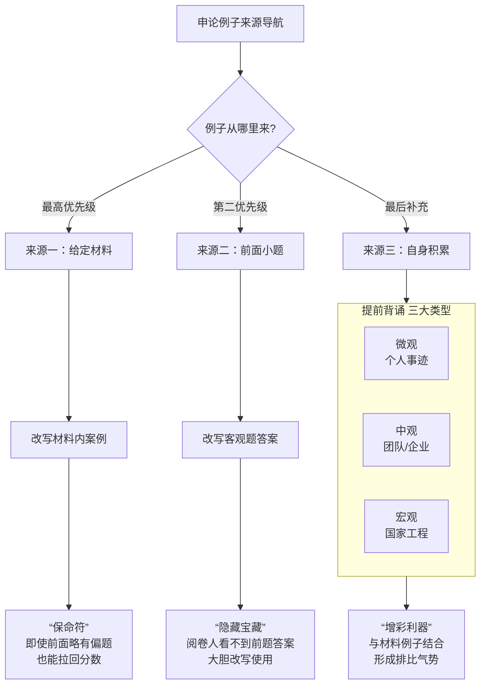

好的，我们来把课程中关于 “例子来源” 的精华部分彻底讲透。这是解决“例子从哪里来”这个核心问题的关键。

东哥在课上反复强调了一个核心原则和三大来源，其战略优先级非常明确。

---

核心心法：例子使用的“宪法”

🟡 材料优先，活用为上；积累备份，锦上添花。

简单说： 任何时候，都优先从本次考试的给定材料里找例子、改例子。这是保命、保分、保不跑题的根本大法。

---

为了让你一目了然，我将老师讲解的例子来源、策略与心法整合成下面这张“寻宝图”，它将是你考场上寻找例子的终极导航：

---

三大来源深度解析

来源一：给定材料 (你的核心例子库)

这是你最主要、最安全的例子来源。

· 怎么找：在通读材料时，有意识地标记出包含 “人物、地区、企业、项目” 等具体信息的段落，这些就是你的“弹药”。
· 怎么用：运用我们刚练过的 “四要素法” 进行缩写和改写。
· 东哥金句：“材料当中的例子是保命的。哪怕你前面感觉写跑偏了，后面一个材料例子能给你拉回来。”

来源二：前面小题 (你的隐藏例子库)

这是一个非常高明且省时的技巧，很多同学都不知道。

· 是什么：前面客观题（概括题、分析题等）的答案要点，本身就是对材料精华的提炼，可以直接成为大作文的例子。
· 怎么用：把客观题答案中关于“做法”、“成效”的要点，用连贯的语言组织起来，就是一个现成的例子。
· 东哥强调：“改第四个题目（大作文）的人，是看不到你前面三个题目的答案的。” 所以，请放心大胆地“借用”。

来源三：自身积累 (你的增彩例子库)

这是在你搞定前两者之后，用来冲击高分的。

· 准备什么：
  1. 微观层面（个人）：如 黄文秀、张桂梅、黄大发、屠呦呦 等。
  2. 中观层面（团队/企业）：如 塞罕坝林场建设者、中国航天团队 等。
  3. 宏观层面（国家工程）：如 脱贫攻坚、疫情防控 等。
· 怎么用：不用多，每个类型背熟 1-2个 经典案例，确保能流畅写出其“主体+对策+影响”即可。最好准备一些 “万能型” 的例子，比如 李忠凯的“32字富民经”，可适配“创新”、“实干”、“担当”、“为民”等多个主题。
· 东哥叮嘱：“不要自己去准备，因为你准备不好。” 意思是，不要自己生编硬造，要去背《感动中国》之类的权威文案，并在此基础上改写。

---

考场上的决策顺序

1. 第一步：看本次材料，优先改写材料内的案例。
2. 第二步：如果材料案例单薄，回头去前面小题的答案里找素材进行改写。
3. 第三步：在完成前两步，且字数、时间都允许的情况下，最后才加上自己背的经典案例，通常以排比句的形式出现，增强气势。

记住这个策略，你在考场上就永远不会为“没例子”而发愁了。
<!--stackedit_data:
eyJoaXN0b3J5IjpbLTE0NjcwNDgyNDBdfQ==
-->